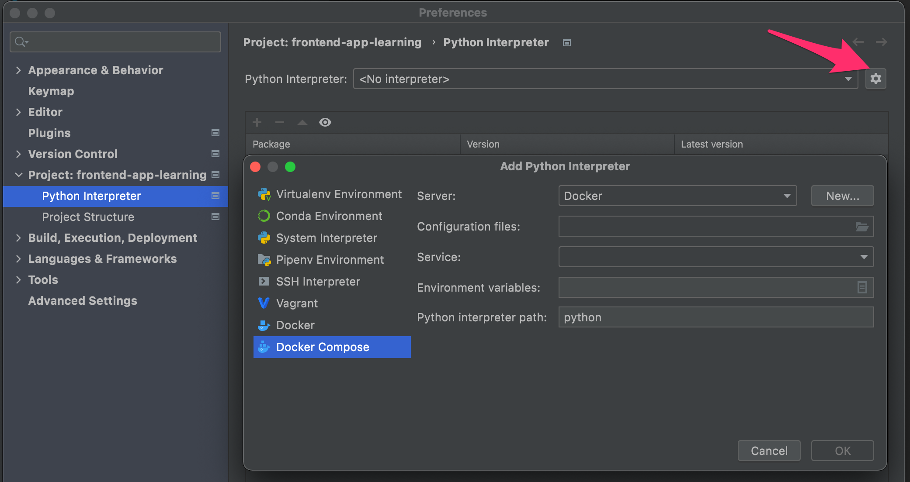

PyCharm Integration
===================

The Professional edition of JetBrains `PyCharm`_ IDE
can be used to develop and debug with Docker and Docker Compose.

Additional PyCharm tips are kept in this `PyCharm IDE setup`_ documentation.

Prerequisites
-------------

1. You must complete all steps for provisioning your Docker Devstack environment
   in the `README`_ before proceeding with the PyCharm setup.

2. If you are on a Mac, make sure you are on a reasonably modern version of MacOS.

Before running Run or Debug in PyCharm
--------------------------------------

**NOTE:** If you are looking for instructions for NFS or docker-sync, see `Deprecated MacOS performance improvements`_.

Every time you run/debug a server or test in PyCharm, you must first ensure the
following:

1. Ensure that all Docker images are stopped outside of PyCharm before starting
   a server or tests from inside PyCharm. PyCharm will potentially disable the
   start button with no further error when this problem occurs. See `Jetbrains ticket PY-22893`_.

Set up Docker Tools
~~~~~~~~~~~~~~~~~~~
In Settings > Build, Execution, Deployment > Docker
Create a new Docker configuration by clicking on the "+" button and selecting the Docker runtime for your machine.
On Mac, select a server that uses Docker for Mac.

Setup a Remote Interpreter
--------------------------

Go to the project-specific Python Interpreter dialog Settings>Project: <projectname> > Python Interpreter.
Click on the gear icon, and select "Add..."

and use the following options in the Add Python Interpreter dialog:

- Interpreter
  - On the left hand side, select "Docker Compose"

- Server
  - Select the Docker Server that was set up in the previous step, "Set up Docker Tools".

- Configuration files

    - ``/LOCAL/PATH/TO/devstack/docker-compose.yml`` (e.g.~/edx/devstack/docker-compose.yml)
    - ``/LOCAL/PATH/TO/devstack/docker-compose-host.yml``
    - ``/LOCAL/PATH/TO/devstack/docker-compose-themes.yml``

- Service: lms (or whatever IDA you wish to test)

- Required Environment variables:

  - ``DEVSTACK_WORKSPACE=/LOCAL/PARENT/PATH/TO/workspace`` (i.e.: Path to where your local repositories are cloned. This needs to be full path an not relative (e.g. './') path to ensure proper configuration of python packages.)

- Optional Environment variables:

  - ``OPENEDX_RELEASE=release.version`` (i.e.: appropriate image tag; "juniper.master")
  - ``COMPOSE_PROJECT_NAME=docker-compose.container`` (i.e.: "devstack-juniper.master"; appropriate docker-compose container project for devstack multiple release (same machine); ensures specific Docker containers get used based on release name; Ref: https://github.com/edx/devstack/pull/532)

- Python interpreter path:

  - The remote path should be set to the service's virtual environment:

    - ``/edx/app/<SERVICE_NAME>/venvs/<SERVICE_NAME>/bin/python``

  - For example, the path would be the following for the Ecommerce Service:

    - ``/edx/app/ecommerce/venvs/ecommerce/bin/python``
    - Note: The Credentials Service might not have a virtualenv set up in the container.

  - For either lms or studio, you need to use edxapp:

    - ``/edx/app/edxapp/venvs/edxapp/bin/python``

- PyCharm helpers path: Keep the default.

**Note**: For lms and studio (edx-platform), it will take a long time to
update skeletons (10 or more minutes). If you want to try a different
set of configuration (compose) files, we recommend you create a new one
so you can easily switch back to old without this delay.

**Warning**: When you change configuration files, the service drop-down gets
reset. Remember to restore to the IDA you wish to test.

**Some Tips**: If your remote isn't loading
- You may need to quit and restart Pycharm for the changes to show.
- You may need to set your DEVSTACK_WORKSPACE variable globally in your ./bash_profile.
- Additionally try resetting docker as a last resort and things should sync successfully after that.

Setup Django Support
--------------------

Before setting up a Server/Debug configuration you will need to setup Django
Support for the specific Project (e.g. LMS and Studio, or ecommerce)

PyCharm -> Preferences -> Languages & Frameworks -> Django

If your Django Project contains a single repo, like ecommerce, your settings
would look as follows:

Django Project Root: /Path/to/docker_devstack/ecommerce

Settings: ecommerce/settings/devstack.py

Manage Script: manage.py

If you have all of the repos open in a single Django Project, you would use the
following:

Django Project Root: /Path/to/docker_devstack

Settings: ecommerce/ecommerce/settings/devstack.py

Manage Script: ecommerce/manage.py

Note: With all repos in the same project, you would need to update these
settings each time you wanted to debug a different project.

Setup a Server Run/Debug Configuration
--------------------------------------

The setup for Server Run/Debug Configurations depends on the service.

Server Run/Debug Configuration for an IDA (not LMS or Studio)
~~~~~~~~~~~~~~~~~~~~~~~~~~~~~~~~~~~~~~~~~~~~~~~~~~~~~~~~~~~~~

After configuring the interpreter, add a new `Django Server Run/Debug
Configuration`_, with the following specific values.

The host should always be set to ``0.0.0.0`` so that Django accepts
requests from external clients (e.g. your Docker host). The port should
be set to the service-specific port from the table above.

*Note*: See next section for additional changes needed for LMS and
Studio.

Setup a Server Run/Debug Configuration for ecommerce
~~~~~~~~~~~~~~~~~~~~~~~~~~~~~~~~~~~~~~~~~~~~~~~~~~~~

Add the following Environment Variables to the Server configuration, these are all
defined on the ecommerce server in /edx/app/ecommerce/ecommerce_env

.. code-block::

  export PATH="/edx/app/ecommerce/nodeenvs/ecommerce/bin:/edx/app/ecommerce/venvs/ecommerce/bin:/usr/local/sbin:/usr/local/bin:/usr/sbin:/usr/bin:/sbin:/bin:/snap/bin"
  export ECOMMERCE_CFG="/edx/etc/ecommerce.yml"
  export DJANGO_SETTINGS_MODULE="ecommerce.settings.devstack"

Setup a Server Run/Debug Configuration for LMS or Studio
~~~~~~~~~~~~~~~~~~~~~~~~~~~~~~~~~~~~~~~~~~~~~~~~~~~~~~~~

For LMS and Studio, the setup is a hack because we (unfortunately)
modified ``manage.py``.

After configuring the interpreter, add a new `Django Server Run/Debug
Configuration`_, with the following specific values.

1. Leave host/port blank

2. Additional options: runserver 0.0.0.0:18000 (or runserver
   0.0.0.0:18010)

3. Custom run command: lms (or cms)

4. Environment variables, add the following for lms/studio:

   - ``DJANGO_SETTINGS_MODULE=lms.envs.devstack_docker`` (or
     cms.envs.devstack_docker)
   - ``PYTHONUNBUFFERED=1``
   - ``CONFIG_ROOT=/edx/app/edxapp``
   - ``LMS_CFG=/edx/etc/lms.yml``

5. Python Interpreter: Choose the Docker Compose interpreter for this
   service.

6. Working directory: /edx/app/edxapp/edx-platform

7. Path mappings (add mapping):

   - Local path: /LOCAL/PATH/TO/edx-platform (e.g. ~/edx/edx-platform)
   - Remote path: /edx/app/edxapp/edx-platform

8. Deselect "Add content..." and "Add source..."

9. Before launch: External tool, Activate tool window

   (i.e ensures release services are stopped prior to launching the debug/run configuration)
   e.g. ``make OPENEDX_RELEASE=juniper.master stop.all`` from "devstack" repo.)

   - Click '+' then `Add New Configuration > Run External tool`

     - Assign values:

       - Name: "Stop all running containers for release."
       - Description: "Stop all running containers for release."
       - Tool Settings:

         - Program: make
         - Arguments: OPENEDX_RELEASE=juniper.master stop.all
         - Working directory: $ProjectFileDir$/devstack

     - Advanced Options

       - (Deselect) Synchronize files after execution
       - (Select) Open console for tool output

         - (Select) Make console active on message in stdout
         - (Select) Make console active on message in stderr

Setup a Run/Debug Configuration for python tests
------------------------------------------------

The setup for a Run/Debug Configurations for python tests depends on the
service.

**Tip**: You can adjust the default configuration with settings you are most
likely to replicate.

Setup a Run/Debug Configuration for python tests for an IDA (not LMS or Studio)
~~~~~~~~~~~~~~~~~~~~~~~~~~~~~~~~~~~~~~~~~~~~~~~~~~~~~~~~~~~~~~~~~~~~~~~~~~~~~~~

To run and debug unit tests, create a **"Django tests"** type Run/Dubug
configuration with the following options:

1. Target: ecommerce.extensions.api.v2.tests.views.test_baskets:BasketCalculateViewTests

2. Environment Variables:

    - DISABLE_MIGRATIONS=1
    - DJANGO_SETTINGS_MODULE=ecommerce.settings.test
    - PYTHONUNBUFFERED=1

3. Working directory: /edx/app/ecommerce/ecommerce

4. Path mappings (add mapping):

   - Local path: LOCAL/PATH/TO/ecommerce (e.g. ~/docker_devstack/ecommerce)
   - Remote path: /edx/app/ecommerce/ecommerce

5. Deselect "Add content..." and "Add source..."

Setup a Run/Debug Configuration for python tests for LMS or Studio
~~~~~~~~~~~~~~~~~~~~~~~~~~~~~~~~~~~~~~~~~~~~~~~~~~~~~~~~~~~~~~~~~~

To run and debug unit tests, edit the **"Defaults -> Python tests -> py.test"** type Run/Debug
configuration with the following options:

1. Python Interpreter: Choose the Docker Compose interpreter for this
   service.

2. Working directory: /edx/app/edxapp/edx-platform

3. Path mappings (add mapping):

   - Local path: LOCAL/PATH/TO/edx-platform (e.g. ~/edx/edx-platform)
   - Remote path: /edx/app/edxapp/edx-platform

4. Deselect "Add content..." and "Add source..."

Then make two changes in PyCharm's preferences:

1. Set "Tools -> Python Integrated Tools -> Default test runner" to "pytest".

2. In "Languages & Frameworks -> Django", uncheck "Enable Django Support".
   Starting in PyCharm 2017.3 (the EAP of which is already available), this
   dialog has a "Do not use Django test runner" checkbox which should be
   enabled instead.

You should now be able to execute tests via the context menu of test files,
classes, or individual test cases.  You can also run custom sets of tests by
creating a custom py.test Run/Debug configuration (which should now be
initialized with the defaults above) and setting its "Target" appropriately.

Currently not supported for PyCharm Development
-----------------------------------------------

- Debugging for BokChoy
- Debugging for JavaScript
- Cython for fasterdebug

Troubleshooting
---------------

General Tips
~~~~~~~~~~~~

1. Ensure that you have fulfilled all of the `Prerequisites`_.

2. Ensure you have completed all steps in `Before running Run or Debug in PyCharm`_
   each time you run the server or tests.

3. PyCharm is often fixing bugs around the relatively new docker-compose
   integration.  If PyCharm has an update, install it.

Can't create Python SDK
~~~~~~~~~~~~~~~~~~~~~~~

While working in PyCharm, you could see the following error:

.. code-block::

   The command '/bin/sh -c mv /user/bin/docker-compose /user/bin/docker-compose-original' returned a non-zero code: 1

This issue has been fixed in PyCharm 2017.1.2.

Cannot open the manage.py file
~~~~~~~~~~~~~~~~~~~~~~~~~~~~~~

The error happens when you try to run a stack (lms or studio for example)::

    Attaching to edx.devstack.lms
    edx.devstack.lms | /edx/app/edxapp/venvs/edxapp/bin/python: can't open file '/edx/app/edxapp/edx-platform/manage.py': [Errno 2] No such file or directory
    edx.devstack.lms exited with code 2
    Aborting on container exit...

Best is to recheck all your settings in particular the Remote Interpreter's settings and make sure that you have included the docker-compose-host.yml file. Make also sure
that you have defined the DEVSTACK_WORKSPACE environment variable correctly (i.e. to the root of your workspace where all repositories are checked out).

You can check which volumes are mounted on each docker container by using the Docker Tool Window. Please note that there is an unnecessary volume creation in the process that
maps /opt/project to the local source file folder. You can safely ignore this unless you forgot to add the  docker-compose-host.yml to the Configuration files in the setup above.

For info, the Docker Tool Window (https://www.jetbrains.com/help/pycharm/using-docker-compose-as-a-remote-interpreter.html) can help to see what's happening:

1. Click on the Docker/devstack instances and find your instance (for example Docker/devstack/lms/edx.devstack.lms)

2. Select the Volume Bindings tab

3. Make sure that the Container path and Host path are right. Normally you should have a line mapping /edx/app/edxapp/edx-platform to the related local source folder (i.e. often DEVSTACK_WORKSPACE/edx-platform).

Project Interpreter has no packages
~~~~~~~~~~~~~~~~~~~~~~~~~~~~~~~~~~~

If you had added an interpreter that was working, but you can no longer see a
list of packages for it under Preferences, you may need to refresh it.

One way to do this is to follow these instructions:

1. Go to Preferences => Project Interpreter

2. Click the "..." button to the right of the "Project interpreter:" drop-down,
   and choose "More...".

3. Click the Edit button (pencil icon) at the bottom for the broken interpreter,
   and then click OK on all dialogs, without making any edits.

.. _Deprecated MacOS performance improvements:

Deprecated MacOS performance improvements
~~~~~~~~~~~~~~~~~~~~~~~~~~~~~~~~~~~~~~~~~
**Warning:** We recommend that new devstack setups on MacOS **no longer use** NFS or docker-sync for MacOS. At this time, these technologies **lead to increased complexity and might cause errors**. Improvements to Docker's default FS have resolved bugs or performance issues that were previously dependent on these workaround technologies.

For further details, read more about the forthcoming `deprecation of NFS`_ and `deprecation of docker-sync`_.

Until these deprecated technologies go through the deprecation and removal process, the following deprecated instructions are left here for legacy purposes:

- Before running Run or Debug in PyCharm

   If you are running with Docker Sync on a mac you will want to first run
   ``docker-sync start`` to run sync in the background before running any
   servers or tests.

   - Configuration files(s)

   - Docker Sync (Mac)

      - ``/LOCAL/PATH/TO/devstack/docker-compose.yml`` (e.g.~/edx/devstack/docker-compose.yml)
      - ``/LOCAL/PATH/TO/devstack/docker-compose-sync.yml``

.. _deprecation of NFS: https://openedx.atlassian.net/browse/DEPR-161
.. _deprecation of docker-sync: https://openedx.atlassian.net/browse/DEPR-162

.. _Django Server Run/Debug Configuration: https://www.jetbrains.com/help/pycharm/2017.1/run-debug-configuration-django-server.html
.. _Jetbrains ticket PY-22893: https://youtrack.jetbrains.com/issue/PY-22893
.. _PyCharm: https://www.jetbrains.com/pycharm/
.. _PyCharm IDE setup: https://openedx.atlassian.net/wiki/spaces/AC/pages/92209229/PyCharm
.. _README: ../README.rst
.. _vendor documentation: https://www.jetbrains.com/help/pycharm/2017.1/configuring-remote-interpreters-via-docker-compose.html
